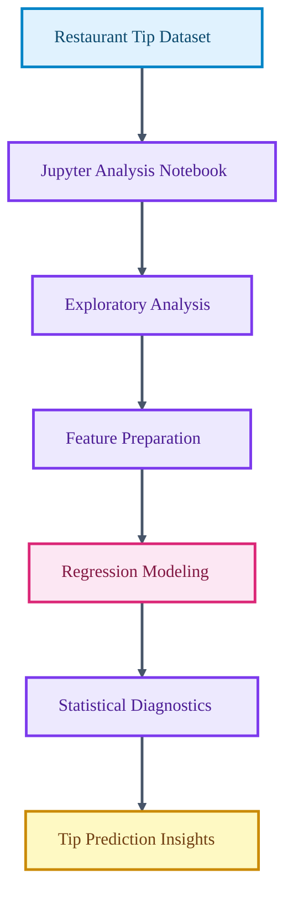

# Restaurant Tip Prediction and Regression Analysis

<p align="center">

  
  
  
  
</p>

<p align="center">
  <strong>A regression-analysis workflow for modeling restaurant tip behavior from dining attributes and statistical diagnostics.</strong>
</p>

This project explores the relationship between dining context, customer behavior, and tip amount through a notebook-based machine learning workflow. It emphasizes data understanding, model selection, diagnostics, and interpretation.

## Core Capabilities

- Loads and analyzes restaurant tipping data in a reproducible notebook.
- Builds regression models for tip prediction.
- Evaluates model behavior through statistical and visual diagnostics.
- Documents insights around feature impact and prediction quality.

## Technical Architecture

The project is organized as a Jupyter notebook analysis with a README summary. The notebook contains the complete workflow from exploration through modeling and evaluation.

## Architecture Diagram



## Technology Stack

- Python notebook workflow.
- Pandas and NumPy for data handling.
- scikit-learn style regression workflow.
- Visualization and statistical diagnostics for interpretation.

## Repository Structure

- `DAI_assignment2(23411030).ipynb` - End-to-end restaurant tip prediction notebook.
- `README.md` - Project documentation.

## Getting Started

```bash
python -m venv .venv
source .venv/bin/activate
pip install pandas numpy scikit-learn matplotlib seaborn jupyter
```

```bash
jupyter notebook
```

## Professional Context

This project demonstrates practical regression analysis, notebook communication, and data-driven reasoning for behavioral prediction.
